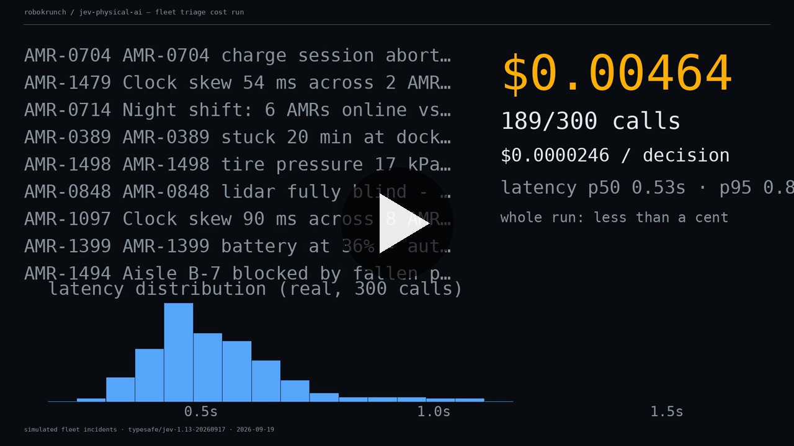

# Jev for Physical AI

Real measured numbers putting TypeSafe's **Jev** to work on robots, fleets, and edge hardware.

Jev is a "System One" model: structured state in, typed probabilistic decisions out — no text generation, 70–500ms, $0.042 per million input tokens with output free. Everyone demos it on browsers and games. We point it at the physical world instead: warehouse robot fleets, incident triage, and the build-vs-buy math of running your own models on edge CPUs.

Every number below comes from runs we actually executed on **2026-09-19**. Real API calls, real latency, real bills. Caveats are stated, not buried.

By [RoboKrunch](https://robokrunch.com) — we benchmark Chinese edge-AI hardware and measure what AI actually costs in the physical world.

## Contents

- [Demo A — 10,000-robot fleet triage](#demo-a--10000-robot-fleet-triage)
- [Demo B — Jev vs self-hosted ModernBERT](#demo-b--jev-vs-self-hosted-modernbert)
- [Reproduce](#reproduce)
- [Video](#video)
- [Limitations](#limitations)
- [Roadmap](#roadmap)
- [License](#license)

---

## Demo A — 10,000-robot fleet triage

**Question:** can Jev serve as the decision layer for a warehouse AMR fleet — triaging incidents faster and cheaper than a small LLM?

**Method.** 41 bilingual (CN/EN) incident templates covering warehouse AMR failures: LiDAR degradation, localization drift, battery faults, pallet detection misses, network partitions, human-zone intrusions. 300 incidents sampled. Each call asks Jev for **3 simultaneous judgments**: escalate to human (yes/no), owning team (choice), urgency (score 0–2). All 300 calls went through OpenRouter (`typesafe/jev-1.13`) on 2026-09-19.

**Results.**

| Metric | Value |
|---|---|
| Successful decisions | 300 / 300 |
| p50 latency | 0.527 s |
| p95 latency | 0.813 s |
| Mean latency | 0.558 s |
| Mean input tokens | 584.9 |
| Cost per decision | $0.0000246 |
| Cost per million decisions | **$24.57** |
| Total spend, this run | **$0.00737** |
| Team agreement vs template labels | 274 / 300 (91.3%) |

**Fleet-scale cost model.** 10,000 robots × 48 decisions/day × 30 days = 14.4M decisions/month:

| | Jev | GPT-4o-mini (est.) |
|---|---|---|
| Cost / month | **$353.81** | $1,814.40 |
| Ratio | 1× | ~5.1× |

GPT-4o-mini is *estimated* ($0.15/M input, $0.60/M output, 600 input + 60 output tokens per call) — we did not measure its triage quality or latency. The 5.1× is a cost ratio, not a quality claim.

**What this actually shows:** sub-second, three-judgments-per-call triage at ~$25 per million decisions, with zero training and zero labeled data. What it doesn't show: production accuracy — our incidents are simulated, so "91.3%" is agreement with template labels, not accuracy on real failures.

---

## Demo B — Jev vs self-hosted ModernBERT

**Question:** at what scale is it cheaper to just run your own classifier?

**Method.** `answerdotai/ModernBERT-base` (149M params) on a 2-core AMD EPYC, CPU-only, batch=1. Frozen encoder + mean pooling + nearest centroid over 18 hand-written exemplars, 100 test incidents — the same fleet-triage domain as Demo A.

**Results.**

| Metric | ModernBERT (self-hosted) | Jev (API) |
|---|---|---|
| p50 latency | **169.3 ms** | 527 ms |
| Mean latency | 197.7 ms | 558 ms |
| Throughput | 5.06 samples/s | ~1.8 decisions/s |
| Judgments per call | 1 label | **3 judgments** |
| Team agreement vs Jev | 66 / 100 | — |
| Training data needed | 18 exemplars + tuning | **zero** |
| Ops burden | you own the VM | zero |

**Crossover math.** Assuming a $24/month 4-vCPU VM, self-hosting breaks even at ≈ **977K decisions/month** — roughly 678 robots at 48 decisions/day. Below that, Jev is cheaper *and* you skip training, labeling, and ops. (A 3-output comparison would push crossover toward ~2.9M/month — not measured, treat as directional.)

**What this actually shows:** Jev's advantage is not raw inference speed — a small local model is ~3× faster. Its advantage is starting cost: no training, no annotation, no infrastructure to babysit. If you're already past ~1M decisions/month with stable labels, self-host.

---

## Reproduce

Demo scripts are all in this repo (runs executed 2026-09-19). Layout:

```
code/              demo scripts (runnable)
├── demo-a.py      # 300 real decisions via OpenRouter (typesafe/jev-1.13)
├── demo-b.py      # ModernBERT self-hosted comparison (CPU-only)
├── charts.py      # regenerates the comparison charts
├── crossover.py   # Jev-vs-self-host cost table + crossover analysis
└── render_video.py# renders the 60-second demo video
data/              measured results (aggregate + per-call records)
├── demo-a-results.json
└── demo-b-results.json
assets/            charts + the 60-second demo video
├── chart-fleet-cost.png
├── chart-latency.png
└── fleet-triage-demo.mp4
REPRODUCE.md       # full reproduction guide + stated limitations
```

To re-run Demo A you need an OpenRouter API key in `OPENROUTER_API_KEY` — never commit keys. Model weights for Demo B download from HuggingFace (~599MB); if your environment sets a proxy, override `NO_PROXY=localhost,127.0.0.1` — bare IPv6 entries in `NO_PROXY` crash newer httpx with `InvalidURL`.

## Video

[](https://github.com/robokrunch/jev-physical-ai/blob/main/assets/fleet-triage-demo.mp4)

60 seconds: 300 real decisions streaming past with a live cost ticker, then the fleet-scale math. Watch the ticker — the entire 300-decision run cost less than a cent. [Direct video link](https://github.com/robokrunch/jev-physical-ai/raw/main/assets/fleet-triage-demo.mp4)

## Limitations

Stated up front, because fake demos are poison:

- Incidents are **simulated** from templates. Agreement with template labels ≠ production accuracy.
- We have **not** tested TypeSafe's native `POST /v1/systemone` — all calls went through OpenRouter's decisions endpoint.
- No real robot hardware, no edge NPU, no long soak test, no probability-calibration study.
- GPT-4o-mini comparison is cost-estimated, not measured; its triage quality is unknown.
- Crossover math assumes a $24/mo VM and ignores your engineering time — which is exactly the point, but do your own sheet.

## Roadmap

- [ ] Re-run Demo A against native `https://api.typesafe.ai/v1/systemone`
- [ ] Probability calibration: are Jev's `confidence` scores honest?
- [ ] Long soak test: 24h continuous triage, watch for drift
- [ ] More fleets: delivery robots, humanoid ops incidents
- [ ] Same triage task on a real edge NPU (RK3588 / Jetson) when hardware budget clears

## License

Code: [MIT](LICENSE). Benchmark data (`data/*.json`): CC-BY 4.0 — use it, cite RoboKrunch.

---

Part of the [robokrunch](https://github.com/robokrunch) org. Curated Jev resources live at [robokrunch/awesome-jev](https://github.com/robokrunch/awesome-jev). Main site: [robokrunch.com](https://robokrunch.com).
